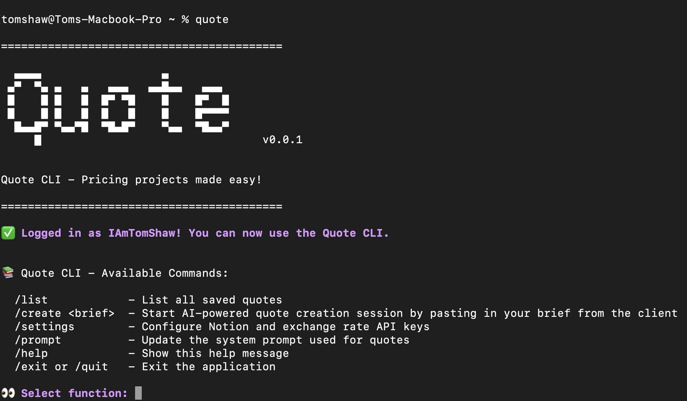

# Quote CLI (TypeScript)

A small, user-focused CLI for generating professional project proposal quotes (estimates) for clients, built with TypeScript.

Originally this tool was built as a web interface using Streamlit and Python (https://github.com/IAmTomShaw/quotation-agent), however I wanted to explore building a CLI tool using TypeScript and Node.js that could be instantly run from the terminal at any time.



> **⚠️ Disclaimer:** This project requires the [GitHub Copilot CLI](https://github.com/features/copilot/cli) to be installed and a valid GitHub Copilot subscription — AI‑driven quote generation features will not work without these prerequisites.

## 📋 Features

- **Generate Proposal Quote:** Create a professional project proposal (estimate) from client briefs.
- **List Quotes:** Show saved templates and previously generated quotes.
- **Persistent Storage:** Quotes and templates are persisted using a lightweight file-based storage (see `lib/storage.ts`).

## Required Third-Party Integrations

- [GitHub Copilot CLI](https://github.com/features/copilot/cli) - for AI-assisted quote generation (requires GitHub Copilot subscription)
- [GitHub Copilot SDK](https://github.com/github/copilot-sdk) - for integrating AI capabilities into projects using the GitHub Copilot CLI
- [Notion API](https://developers.notion.com/) (FREE with a Notion account) - for accessing your pricing information (I store mine in Notion as a document)
- [ExchangeRate-API](https://www.exchangerate-api.com/) (FREE) - for currency conversion when generating quotes in different currencies

## 🚀 Getting Started

Requirements:

- Node.js 18+ and npm

Install dependencies:

```bash
npm install
```

Run in development mode (no build required):

```bash
npm run dev
```

Build for production:

```bash
npm run build
```

Run the CLI directly (after building):

```bash
node ./bin/quote.js
```

Make the command available globally for convenience:

```bash
npm link
quote            # now you can run the `quote` command anywhere
```

> **⚠️ Disclaimer:** You will need to set your NOTION_API_KEY, NOTION_PAGE_ID and EXCHANGE_RATE_API_KEY using `/settings` when you first run the CLI.

**Usage**

- Generate a new quote (example):

```bash
/create 2x short-form videos for a social media marketing campaign

# You can converse with the agent to refine the quote like a chatbot

/close # to finish and save the quote

```

- List available templates:

```bash
/list
```

- Open and edit a saved quote:

```bash
/list
(Select quote from list using arrow keys + Enter)
```

## 📁 Project Structure

```
.
├── src/                 # TypeScript source
│   ├── index.ts         # CLI commands and argument handling
│   ├── lib/             # contains small libraries (settings, storage)
│   ├── ui/              # terminal output helpers
│   └── agent/           # helper agents and tools
├── assets/              # screenshots and images
├── .gitignore           # git ignore rules
├── README.md            # project documentations
├── tsconfig.json        # TypeScript configuration
└── package.json         # npm package configuration
```

## 🤝 Contributing

Contributions are welcome. Suggested workflow:

1. Fork the repository.
2. Create a feature branch: `git checkout -b feat/my-feature`.
3. Make changes, add tests if appropriate.
4. Run the build: `npm run build`.
5. Open a pull request describing your changes.

Please keep changes focused and include tests or usage examples when adding features.


## 📝 License

This project is licensed under the MIT License.

---

Built with ❤️ by [Tom Shaw](https://tomshaw.dev)